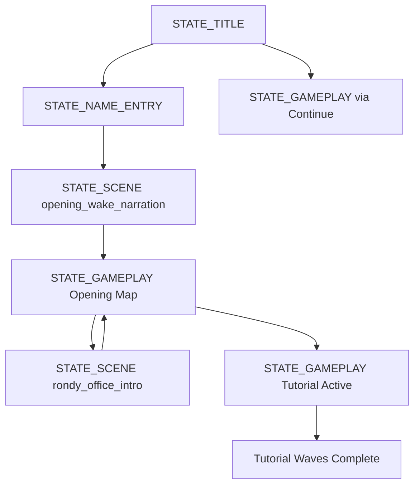
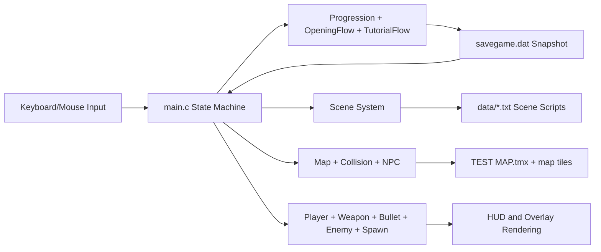
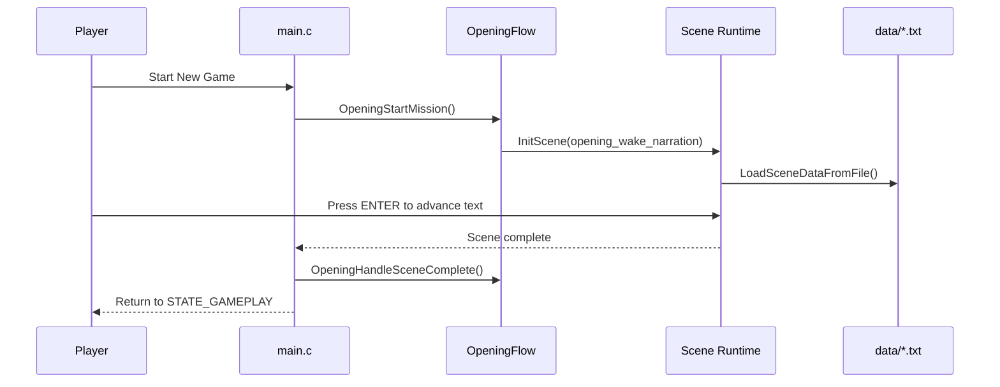

# EXECUTE - Source Code v1.0

A raylib-based C game that combines exploration, story scenes, and tutorial combat in a chapter-driven structure.

## 1. Requirement Coverage

This README explicitly documents all required areas:

| Requirement | Covered In |
|---|---|
| Project design | Section 2 |
| System architecture | Section 3 |
| Module responsibilities | Section 4 |
| Implementation decisions | Section 5 |
| AI usage log | Section 6 |
| Illustrations (flowchart, system/scene diagrams, visual references) | Section 7 |

## 2. Project Design

### 2.1 Design Goals

1. Keep game progression clear: Title -> Opening -> Tutorial.
2. Keep story content editable without recompiling C code.
3. Keep gameplay loop stable with explicit state transitions.
4. Keep player UX smooth with pause/save/settings support.

### 2.2 High-Level Player Journey

1. Enter title screen and start or continue.
2. Watch opening narrative scene.
3. Explore opening map and interact with Rondy/doors.
4. Transition to tutorial map and clear waves.
5. End of current playable chapter scope.

### 2.3 Core Gameplay Loop

1. Input handling (keyboard/mouse).
2. State update (`main.c` by active `GameState`).
3. Chapter update (`OpeningFlow` or `TutorialFlow`).
4. Collision/combat update.
5. Render world, overlay, and HUD.

## 3. System Architecture

### 3.1 State Flowchart



### 3.2 System Diagram



### 3.3 Scene Interaction Diagram



## 4. Module Responsibilities

| Module | Main Responsibility | Key Files |
|---|---|---|
| Application state and flow | Own `GameState` transitions, central update/draw loop, save/load integration | `main.c`, `GameUI/GameStates.h` |
| Window/display settings | Shared resolution/fullscreen globals and window mode changes | `Basic Settings/window_setting.c`, `Basic Settings/window_setting.h` |
| Player and combat core | Player movement/stats, weapon behavior, bullet lifecycle, enemy chase/health | `Player/Player.c`, `Weapon/Weapon.c`, `Bullet/Bullet.c`, `Enemy/Enemy.c` |
| World and collision | TMX map loading, blocked-tile checks, door interaction zones, collision resolution | `Map/Map.c`, `Collision/Collision.c` |
| Story and scene playback | Scene data parsing, typewriter text rendering, texture lifecycle, scene runtime | `Scene/Scene.c`, `Scene/Scene.h`, `Scene/SceneData.h` |
| Chapter controllers | Opening-specific and tutorial-specific mission logic | `Opening/OpeningPhase.c`, `Tutorial/TutorialPhase.c`, `Progression/Progression.c` |
| Support systems | Enemy spawn control, cursor aim utilities, clickable text UI, NPC rendering/collision | `Spawn/Spawn.c`, `Mouse/MouseAim.c`, `Mouse/MouseClicked.c`, `NPC.c` |

## 5. Implementation Decisions

### Decision 1: Data-driven scene scripts

- Decision: Move scene lines from hard-coded arrays to `data/*.txt` files.
- Why: Story editing becomes content work instead of code changes.
- Tradeoff: Requires parser and runtime validation for malformed lines.

### Decision 2: Binary save snapshot (`savegame.dat`)

- Decision: Save major runtime structures in one binary snapshot.
- Why: Fast restore path for continue and pause-save workflows.
- Tradeoff: Save format versioning is required when structures change.

### Decision 3: Property-based TMX collision

- Decision: Read tile/layer/tileset bool properties (`collision`, `door`) for collision logic.
- Why: Designers can tune map behavior in Tiled without C rewrites.
- Tradeoff: Invalid map metadata can break expected collision behavior.

### Decision 4: Chapter-specific flow controllers

- Decision: Keep opening and tutorial logic in dedicated modules.
- Why: `main.c` stays readable while chapter behaviors remain isolated.
- Tradeoff: More cross-module interfaces to maintain.

### Decision 5: Configurable text speed

- Decision: Add global scene typing speed setting and expose controls in settings menus.
- Why: Improves readability/accessibility across players.
- Tradeoff: Requires clamping and consistent initialization across new scenes.

## 6. AI Usage Log

| Date | Task | AI Assistance Used For | Human Verification |
|---|---|---|---|
| 2026-03 | Scene system updates | Refactor support for data-driven scene loading and parser structure | Build + runtime scene progression checks |
| 2026-03 | Save/pause flow | Logic review for continue/new game/pause-save paths | Build + title/continue/pause behavior tests |
| 2026-03 | Code readability pass | Comment quality improvements across core modules | Full rebuild + diagnostics scan |
| 2026-03-28 | README compliance update | Requirement mapping, architecture diagrams, and documentation structure | Manual README review against required checklist |

## 7. Illustrations

### 7.1 Concept Art and Visual References

Opening room concept art:


Rondy office concept art:


Rondy character art:


Dialog UI visual reference:


### 7.2 Screenshot Guidance

Gameplay screenshots are strongly recommended for final submission package quality.

Suggested capture list:

1. Title screen with Continue/New Game menu.
2. Opening exploration map with interaction prompt.
3. Rondy office scene dialog frame.
4. Tutorial combat wave with HUD visible.

## 8. Build and Run

### Build (VS Code task)

Run task: `build raylib game`

### Build (manual)

```powershell
gcc main.c Player/Player.c Camera/CameraSet.c Mouse/MouseAim.c Mouse/MouseClicked.c Weapon/Weapon.c Bullet/Bullet.c Enemy/Enemy.c Collision/Collision.c Spawn/Spawn.c Map/Map.c "Basic Settings/window_setting.c" Scene/Scene.c Opening/OpeningPhase.c Tutorial/TutorialPhase.c Gameplay/CombatRuntime.c Progression/Progression.c NPC.c -o game.exe -I . -I include -I Player -I Camera -I Mouse -I Weapon -I Bullet -I "Basic Settings" -I Enemy -I Collision -I Spawn -I Map -I GameUI -I Scene -I Opening -I Tutorial -I Gameplay -I Progression -I Assets -L lib -lraylib -lopengl32 -lgdi32 -lwinmm
```

Run:

```powershell
.\game.exe
```

## 9. Controls

- `W/A/S/D`: Move
- `Mouse`: Aim
- `Left Click`: Fire
- `R`: Reload
- `E`: Interact (doors/NPC/tutorial transport)
- `ESC`: Pause in gameplay, quit outside gameplay
- `F11`: Toggle fullscreen

## 10. Known Gaps and Next Steps

Known gaps:

1. Current playable scope is opening + tutorial chapters.
2. Branching endings and advanced quest outcomes are not implemented yet.

Recommended next steps:

1. Add branch flags and choice UI in scene scripts.
2. Introduce multiple ending routes.
3. Add BGM/SFX mixer controls in settings.
4. Capture and embed final gameplay screenshots in this README.
